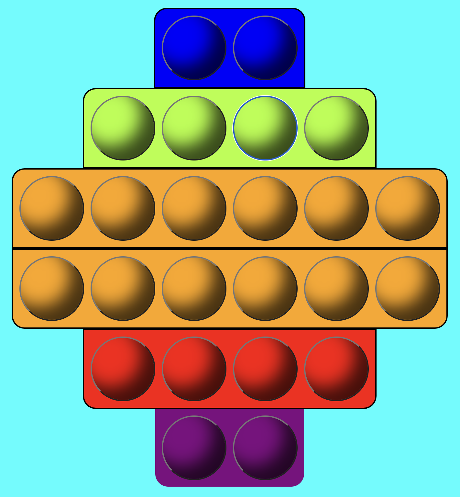
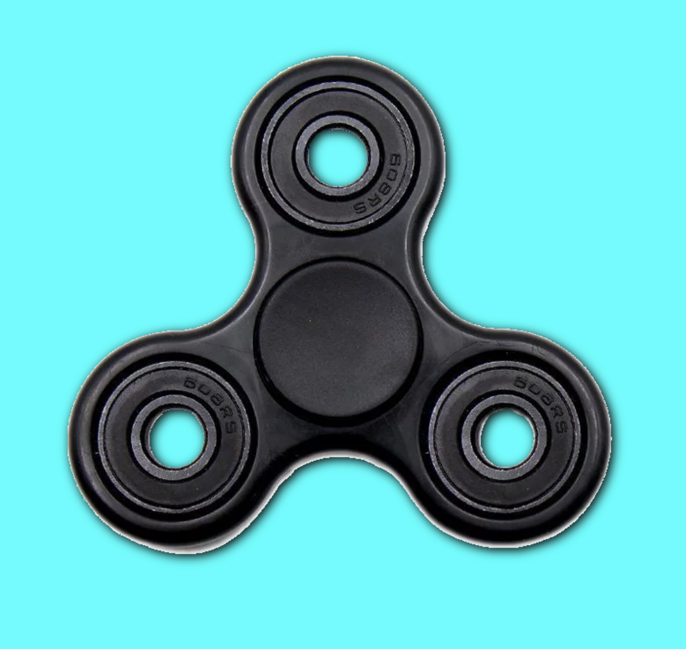

# Pop it and spinner game

A game that simulates a pop-it toy and a fidget spinner.

## ⚙️ Technologies

-   HTML
-   CSS
-   JavaScript

## 🔧 Tools

Used [@PixelsCommander](https://github.com/PixelsCommander/)'s [Propeller.js](https://github.com/PixelsCommander/Propeller/) to make the fidget spinner spin.

 

## Note:

The website is incomplete, it still needs to be responsive.

 

## ✒️ Author

| [ @M-Alhassan](https://github.com/M-Alhassan) |
| :---------------------------------------------------------------------------------------------------------------------------: |
